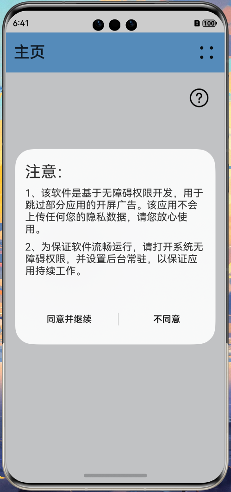
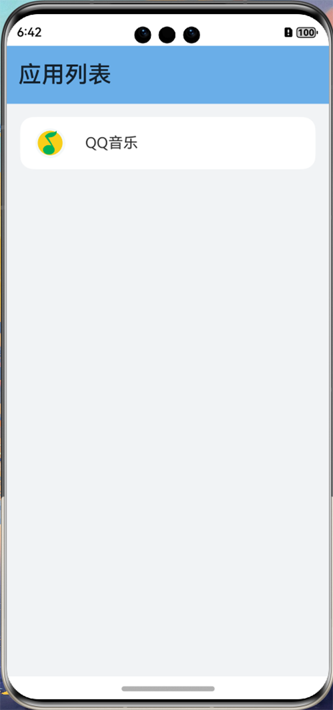
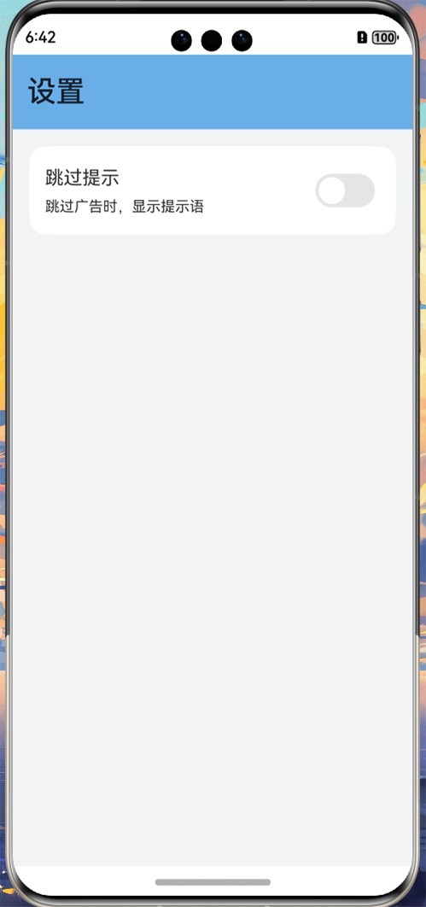

# AdSkipper

使用 ArkTS 语言，基于 Accessibility Kit 开发的实现跳过开屏广告的**原生鸿蒙应用**

## 注意：

该软件还处于**早期开发阶段**，部分功能尚未完善，且**目前 [Accessibility Kit](https://developer.huawei.com/consumer/cn/doc/harmonyos-references-V5/accessibility-api-V5) 
功能尚不完善**以至开发受阻，系统功能完善后**将会继续开发维护该项目**

## 安装：

1. 在电脑上下载 [DevEco Studio](https://developer.huawei.com/consumer/cn/download/)，并按照提示完成安装
2. 下载该项目所有文件，并**将项目用 DevEco Studio 打开**
3. 在手机上打开设置 - 系统 - 开发者选项中的**开发者模式和 USB 调试**，并将其连接至电脑，保证其能被 DevEco Studio 识别
4. 用 DevEco Studio 打开 ./products/default/src/main/ets/pages/Index.ets ，将其运行至手机上

## 开发计划：

- [x] ~~基本 UI 界面的开发~~
- [x] ~~获取屏幕组件树~~
- [ ] 对组件进行操作
- [ ] 性能的优化以降低延迟、能耗
- [ ] 自定义规则
- [ ] 对规则进行导入、导出以及订阅网络规则

## 屏幕截图：

|                                   |                                    |
|-----------------------------------|------------------------------------|
|    |      |
|  |  |